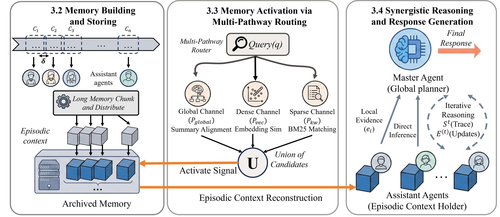

# E-mem: Multi-Agent Based Episodic Context Reconstruction for LLM Agent Memory

[](https://arxiv.org/abs/2601.21714)
[](https://opensource.org/licenses/Apache-2.0)
[](https://docs.astral.sh/ruff/)
[](https://github.com/astral-sh/uv)
[](https://github.com/pre-commit/pre-commit)

⭐ If you like our project, please give us a star on GitHub!

---

🎉Congratulations that E-mem has been accepted by **ICML 2026**.
**E-mem** is a novel memory framework designed to address the "destructive de-contextualization" problem in traditional RAG and long-context systems. Instead of compressing memory into static embeddings or graphs, E-mem shifts the paradigm to **Episodic Context Reconstruction**.

Inspired by biological engrams, E-mem employs a **Heterogeneous Hierarchical Architecture**:
1.  **Master Agent**: Orchestrates global planning and synthesizes reasoning.
2.  **Assistant Agents**: Maintain uncompressed memory chunks and perform local reasoning within activated segments to extract context-aware evidence.

By combining a **Multi-Pathway Routing** mechanism with distributed agentic reasoning, E-mem achieves State-of-the-Art performance on complex benchmarks (LoCoMo, HotpotQA) while significantly reducing token costs compared to full-context approaches.

<div align="center">
  
  <p><b>E-mem Architecture Overview</b></p>
</div>

---

## 📑 Table of Contents

* <a href='#-key-features'>🌟 Key Features</a>
* <a href='#-installation'>📦 Installation</a>
* <a href='#-quick-start'>⚡ Quick Start</a>
* <a href='#-documentation'>📚 Documentation</a>
* <a href='#-project-structure'>📁 Project Structure</a>
* <a href='#-testing'>🧪 Testing</a>
* <a href='#-evaluation-reproducing-results'>📊 Evaluation</a>
* <a href='#-contributing'>🤝 Contributing</a>
* <a href='#-license--attribution'>📄 License</a>

---

## 🌟 Key Features

* **🧩 Episodic Context Reconstruction**: Unlike passive retrieval, Assistant agents actively reason within raw memory contexts to preserve sequential dependencies and logical integrity.
* **🤖 Master-Assistant Architecture**: Decouples high-level planning from low-level memory retention, enabling scalable "System 2" reasoning over extended horizons.
* **🛣️ Multi-Pathway Routing**: Implements a robust routing policy combining three orthogonal signals:
    * **Global Alignment**: Summary-based intent filtering.
    * **Semantic Association**: High-dimensional vector similarity.
    * **Symbolic Trigger**: Precise keyword/entity matching.
* **⚡ Latent State Optimization (KV Cache)**: Supports caching internal neural representations (KV tensors) for Assistant agents. This minimizes re-encoding overhead during memory activation.
* **🔌 Flexible Storage Modes**:
    * **KV Cache Mode**: Uses local/cached tensors.
    * **Text Mode**: A lightweight approach for API-based debugging or cloud inference. 

## 📦 Installation

We recommend using `uv` for dependency management.

```bash
# Clone the repository
git clone https://github.com/dog-last/E-mem.git
cd E-mem

# Install with uv (Recommended)
uv sync

# Setup configuration
cp config.kv.yaml config.yaml
# Or start from text mode:
# cp config.text.yaml config.yaml
# Edit config.yaml with your settings
```

The repository-root `config.yaml` is for the library, quickstart, and examples. The benchmark runners use benchmark-local configs by default:
- `evaluation/locomo/config.yaml`
- `evaluation/hotpotqa/config.yaml`

## ⚡ Quick Start

Get up and running with the E-mem factory. This example initializes a Master-Assistant setup.

```python
from src.conversation_manager import create_chat_manager

# 1. Initialize E-mem Manager
# The manager handles the coordination between the Master Agent and Assistant Agents.
manager = create_chat_manager(
    storage_mode="kv_cache",           # Enable Latent State Optimization (or use "text" for pure API)
    model_id="Qwen/Qwen3-4B",          # Assistant Agent Model (SLM)
    chat_openai_config={               # Top-level manager/tool-calling model
        "api_key": "your-key",
        "base_url": "https://api.openai.com/v1",
        "model": "gpt-4o-mini"         # Master Agent (Global Planner)
    },
    aggregator_openai_config={         # Aggregation model
        "api_key": "your-key",
        "base_url": "https://api.openai.com/v1",
        "model": "gpt-4o-mini"
    },
    router_openai_config={             # Router / fallback router model
        "api_key": "your-key",
        "base_url": "https://api.openai.com/v1",
        "model": "gpt-4o-mini"
    }
)

# 2. Add Memory (Memory Building)
# The system performs chunking and distributes contexts to Assistant Agents.
manager.chat("My name is Alice and I am a software engineer.", auto_save=True)

# 3. Query Memory (Reconstruction & Reasoning)
# Triggers Multi-Pathway Routing -> Assistant Local Reasoning -> Master Synthesis.
response = manager.chat("What is my profession?")
print(response)
# Output: "You are a software engineer."
```

In YAML config files, most users only need to set `model.memory_agent_model` and `model.general_model`. The role-specific fields `manager_model`, `aggregator_model`, `router_fallback_model`, and `question_answer_model` are optional overrides that default to `general_model`. See [Config Model Roles](docs/CONFIG_MODELS.md) for model-role semantics and [Config Reference](docs/CONFIG_REFERENCE.md) for the rest of the config fields.

## 📚 Documentation

Detailed documentation for researchers and engineers.

| Resource | Description |
|:---|:---|
| **[Architecture](docs/ARCHITECTURE.md)** | Deep dive into the Master-Assistant design and Routing mechanisms. |
| **[Operational Guides](docs/GUIDES.md)** | Guides on Persistence, Latent State Caching, and Model Compatibility. |
| **[Config Model Roles](docs/CONFIG_MODELS.md)** | Explains `memory_agent_model`, `general_model`, and the optional role overrides for manager / aggregator / router / QA. |
| **[Config Reference](docs/CONFIG_REFERENCE.md)** | Explains the non-model config fields such as memory chunking, router tuning, evaluation settings, and logging. |
| **[API Reference](docs/API_REFERENCE.md)** | Complete API specification for Managers, Handlers, and Config. |

## 📁 Project Structure

```
E-mem/
├── src/
│   ├── agent/                    # Base agent with tool calling
│   ├── config/                   # Pydantic configuration schemas
│   ├── conversation_manager/     # Chat interface & factory
│   │   ├── base_chat_manager.py  # Shared base class
│   │   ├── chat_handler.py       # Implementation of memory reconstruction logic
│   │   └── factory.py            # Factory function
│   ├── memory/
│   │   ├── core/                 # Memory handlers
│   │   ├── kv_block_manager/     # Latent state (KV) storage implementation
│   │   ├── memory_agent/         # Assistant Agent implementation
│   │   └── router/               # Multi-Pathway Routing (Global/Semantic/Symbolic)
│   └── utils/                    # Utilities & prompts
│       ├── parser.py             # Response parsing utilities
│       └── prompt.py             # System prompt templates
├── evaluation/
│   ├── locomo/                   # LoCoMo benchmark scripts
│   └── hotpotqa/                 # HotpotQA benchmark scripts
├── examples/                     # Usage examples
│   ├── quickstart.py             # Quick start demo
│   ├── example_text_storage.py   # Text storage mode example
│   └── example_storage_comparison.py
├── scripts/                      # Evaluation runner scripts
│   ├── eval_locomo.sh
│   └── eval_hotpotqa.sh
├── tests/                        # Unit tests
├── docs/                         # Documentation
├── config.kv.yaml                # KV cache configuration template
├── config.text.yaml              # Text mode configuration template
└── config.py                     # YAML → Pydantic configuration loader
```

## 🧪 Testing

Ensure system stability with our comprehensive test suite.

```bash
# Run all tests
pytest tests/

# Run with coverage
pytest tests/ --cov=src --cov-report=html

# Run specific test file
pytest tests/test_chat_manager.py -v
```

## 📊 Evaluation (Reproducing Results)

To reproduce the results presented in our paper, we provide automated scripts for both **LoCoMo** and **HotpotQA** benchmarks.

### LoCoMo Benchmark
Evaluates long-term memory coherence, including multi-hop and temporal reasoning tasks.

```bash
# Run LoCoMo evaluation
bash scripts/eval_locomo.sh

# Equivalent explicit config
bash scripts/eval_locomo.sh --config evaluation/locomo/config.yaml
```

### HotpotQA Benchmark
Stress-tests the system on multi-hop QA with ultra-long contexts (streaming setting).

```bash
# Run HotpotQA evaluation
bash scripts/eval_hotpotqa.sh

# Equivalent explicit config
bash scripts/eval_hotpotqa.sh --config evaluation/hotpotqa/config.yaml
```

> The root `config.yaml` is not used by these evaluation commands unless you pass it explicitly. Detailed benchmark configuration and baseline comparisons can be found in [`evaluation/locomo/README.md`](evaluation/locomo/README.md) and [`evaluation/hotpotqa/README.md`](evaluation/hotpotqa/README.md).

## 🤝 Contributing

We welcome contributions to E-mem! Please follow this workflow to ensure quality:

1.  **Fork & Clone**: Fork the repository and clone it locally.
2.  **Install Dependencies**:
    ```bash
    uv sync
    ```
3.  **Setup Pre-commit**:
    Ensure code quality hooks are active.
    ```bash
    pre-commit install
    ```
4.  **Run Tests**:
    Verify that your changes don't break existing functionality.
    ```bash
    pytest tests/
    ```
5.  **Update Documentation**:
    If you modify the API or features, please update the relevant `docs/*.md` files or README.md file.

## 📄 License & Attribution

This project is licensed under the **Apache License 2.0**. See [LICENSE](LICENSE) for details.

### Acknowledgements
This project includes some evaluation code adapted from the **GAM (General Agentic Memory)** framework. We explicitly acknowledge and thank the original authors. Please see [NOTICE](NOTICE) for detailed attribution and license information regarding third-party code.
