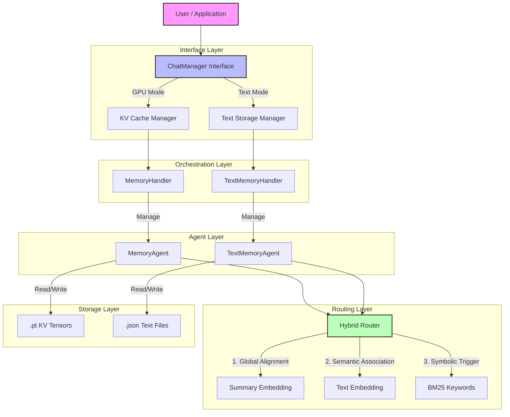

# System Architecture

## Overview

E-mem provides a unified memory management interface that abstracts the underlying storage mechanism. Whether running on high-end GPUs with KV caching or using API-based text storage, the system maintains a consistent architecture for memory persistence, retrieval, and context management.

## 🏗️ High-Level Architecture

The system follows a hierarchical design where the **ChatManager** acts as the main interface, orchestrating **MemoryHandlers**, which in turn manage **MemoryAgents** (blocks).

### Component Hierarchy

| Component | Role | Description |
|-----------|------|-------------|
| **ChatManager** | **Interface** | The primary entry point. Handles user interaction, tool execution, and configuration. |
| **MemoryHandler** | **Orchestrator** | Manages the lifecycle of memory blocks (creation, retirement, loading). |
| **MemoryAgent** | **Unit** | Represents a single block of memory (e.g., a conversation segment). Manages its own storage. |
| **HybridRouter** | **Retrieval** | Selects the most relevant memory blocks for a given query. |
| **Storage** | **Persistence** | Physical storage of data (`.pt` tensors or `.json` text). |

---

## 🔄 Dual Storage Modes

The system supports two storage backends, designed to be architecturally equivalent but optimized for different resources.

| Feature | KV Cache Mode (Main) | Text Storage Mode (Debug/API) |
|---------|---------------|-------------------|
| **Use Case** | Local GPU deployment, privacy, fine-grained control | API usage, debugging, low resource envs |
| **Storage Format** | PyTorch Tensors (`.pt`) | JSON Files (`.json`) |
| **Inference** | Pre-computed KV Cache (Local optimization) | Raw text injection (Cloud API speed) |
| **Hardware** | Requires GPU (VRAM) | CPU only |
| **Persistence** | Full tensor state | Text content only |

---

## 🧠 Hybrid Routing Engine

The **HybridRouter** is the brain of the retrieval system, employing a three-channel scoring mechanism to find relevant memories.

1.  **Global Alignment** (Summary Embedding):
    *   *Method*: Cosine similarity of query embedding vs. block summary embedding.
    *   *Purpose*: Captures high-level topic relevance.
    *   *Weight*: Default 30%.

2.  **Semantic Association** (Text Embedding):
    *   *Method*: Cosine similarity of query embedding vs. chunked original text.
    *   *Purpose*: Finds specific semantic details within blocks.
    *   *Weight*: Default 40%.

3.  **Symbolic Trigger** (BM25):
    *   *Method*: BM25 keyword matching.
    *   *Purpose*: Captures exact keyword matches (names, IDs, specific terms).
    *   *Weight*: Default 30%.
    *   *Note*: Supports Jieba tokenizer for Chinese text.

---

## ⚙️ Technical Mechanisms

### Memory Lifecycle

1.  **Ingestion**: User input is processed by the **Active Agent**.
2.  **Accumulation**: Data is added to the current block until it reaches the `block_size` limit.
3.  **Retirement**:
    *   The block is marked as "inactive".
    *   A **Summary** is generated via Memory Agent with SLM (KV Cache mode).
    *   Data is flushed to disk (`.pt` or `.json`).
4.  **Retrieval**:
    *   Router scores all inactive blocks + active block.
    *   Top-K blocks are loaded (or retrieved from cache).
    *   Selected blocks form the context for the response.

### KV Cache Specifics

In **KV Cache Mode**, we optimize for long-context performance by persisting the **Key-Value states** of the attention mechanism.

*   **Mechanism**: Instead of feeding raw text to the model every time, we feed the pre-computed KV tensors.
*   **Performance**: Reduces "Time to First Token" (TTFT) significantly for long histories.
*   **Model Dependency**: KV caches are strictly tied to the model architecture (layers, heads, dimensions). **They are not cross-compatible between different models.**

### Persistence Model

*   **Metadata**: `agents_metadata.json` tracks all blocks, their status, and summaries.
*   **Lazy Loading**: Only metadata is loaded at startup. Heavy tensor files are loaded on-demand during retrieval.
*   **Auto-Save**: State is automatically persisted when blocks fill up or the session ends.
